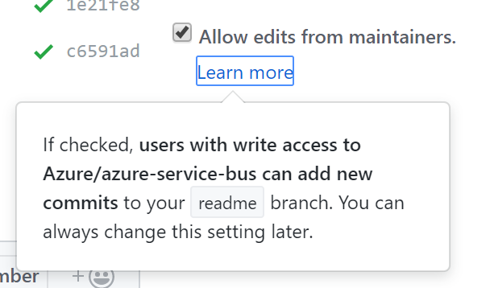

# Quick tips for reviewing pull requests

How to review code is out of scope, but there are a few policies to call out that can expidite the pull request process. Having an overly burdensome review process is a quick way to discourage contributions. Remember, you want to ***set up your project for success***.

## Don't be a linter

If you find yourself calling attention to various style guide violations, refer the submitter to the style guide. Improvde the style guide if necessary. Better yet, use a linterbot (*TODO* link).

## Make minor fixes

If the pull request only requires minor fixes, consider making them yourself. GitHub includes a feature that defaults pull request branches to grant access to maintainers, even in a different fork.

