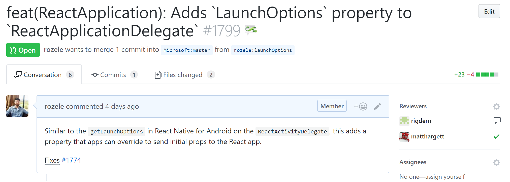

# Tools for reviewing pull requests

While the specifics of "how to review code" is out of scope, it is useful to call out tools that can make reviewing code easier. There are many options for reviewing code, and while nothing beats pulling a branch and stepping through it for yourself, this may be overkill for repos with adequate tests.

- GitHub
- VSTS
- Reviewable
- CodeFlow (Microsoft-only)

## GitHub

## VSTS

## Reviewable

Check it out at [https://reviewable.io].

Reviewable has a number of useful features, such as viewing diffs since the last time you looked, with a lot of options to customize, such as the criteria for review completion and how the diffs are displayed.

## CodeFlow (Microsoft internal)

