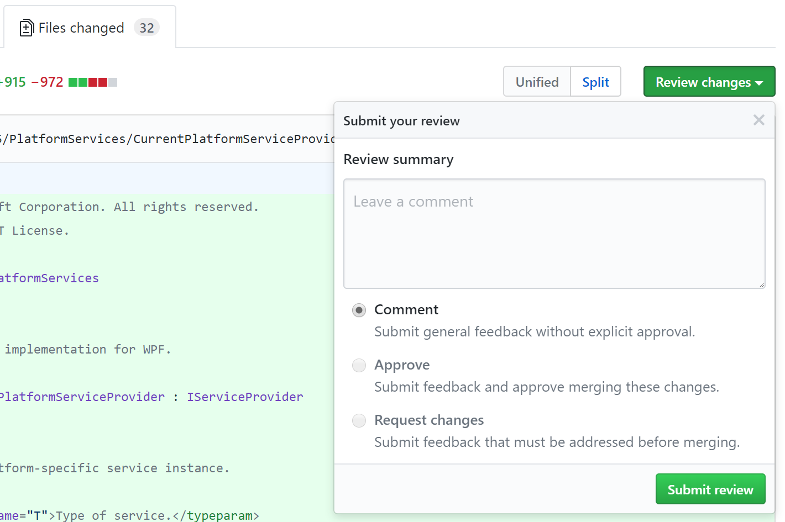
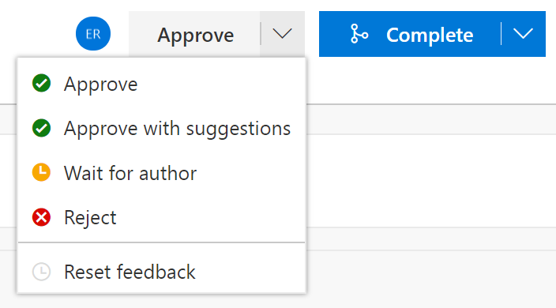

# Tools for reviewing pull requests

While the specifics of "how to review code" is out of scope, it is useful to call out tools that can make reviewing code easier. There are many options for reviewing code, and while nothing beats pulling a branch and stepping through it for yourself, this may be overkill for repos with adequate tests.

- GitHub
- VSTS
- Reviewable
- CodeFlow (Microsoft-only)

## GitHub

## VSTS

## Reviewable

*TODO:* Link
*TODO:* screenshot from Reviewable
*TODO:* screenshot of GitHub webhook

## CodeFlow (Microsoft internal)

*TODO:* Link to Chrome Plugin
*TODO:* screenshot from CodeFlow
