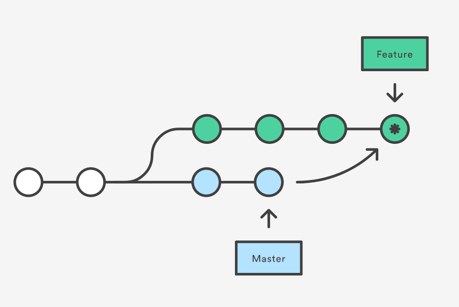
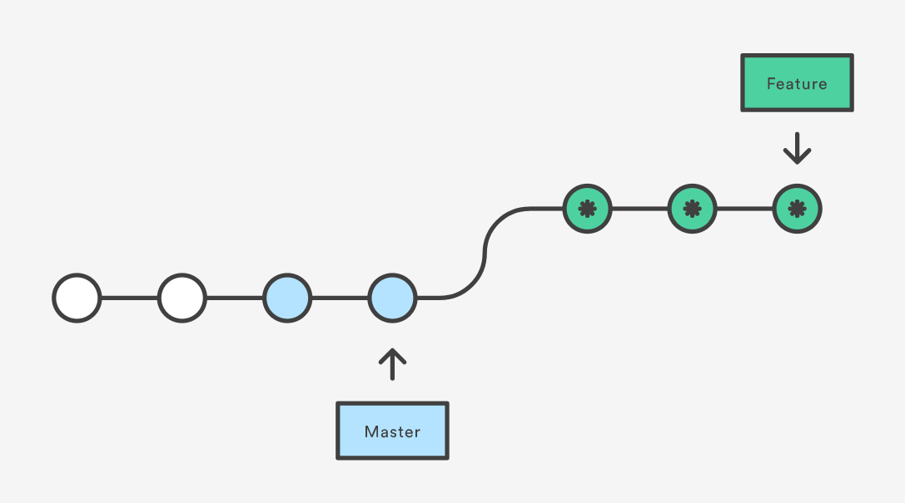

# Merging Pull Requests

When all tests have passed and there is committer or maintainer sign off, a pull request is ready to merge. GitHub provides a few different options for merging pull requests from the Web UI, and there are many ways to merge code from a CLI.

## Ways to Merge on GitHub

![../img/MergeOptions.png]

* Merge
* Squash and merge
* Rebase and merge

### Merge

### Rebase

